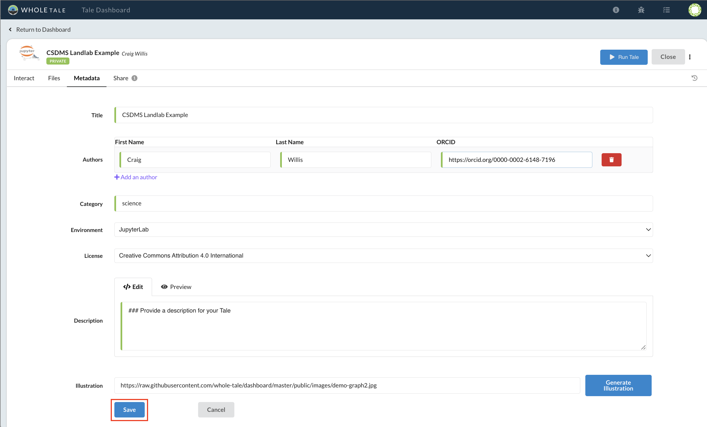
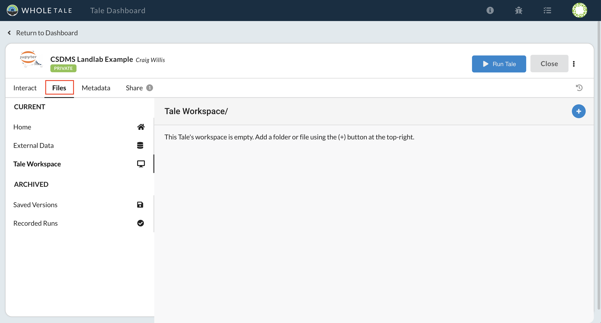
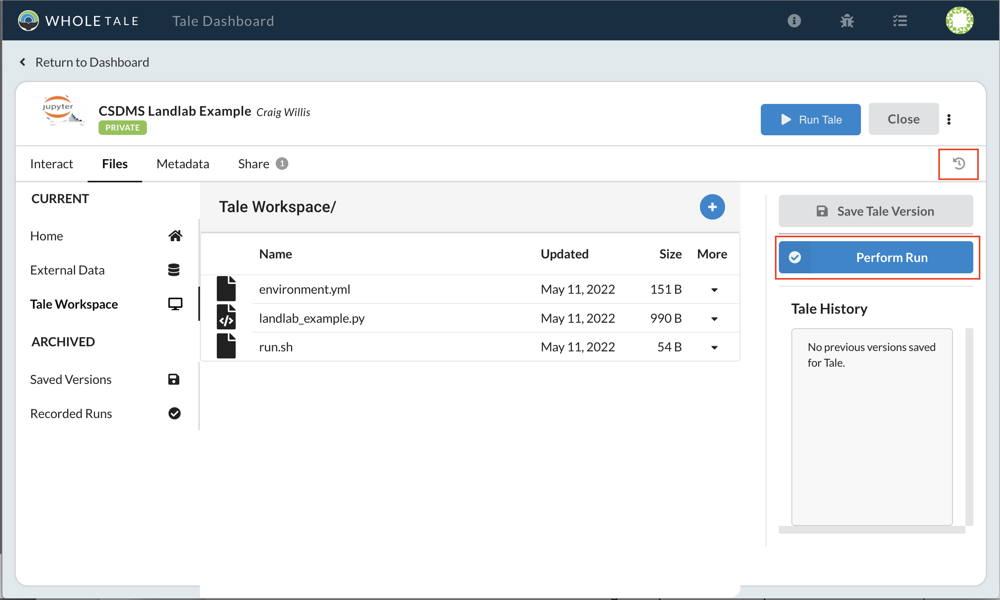

# Creating and running tales

In this lesson you'll learn how to create a new tale in Whole Tale.

Questions:
* How do I create my own tale?
* What is the tale "workspace"?
* How do I upload files?
* How to I customize the environment?
* How do I create a recorded run?

Objectives:
* Learn how to create a tale
* Learn about the tale folder structure
* Learn how to rebuild the tale image and restart your instance
* Learn how to execute a recorded run

## Activity: Create a Tale

From the dashboard:
* Select the "Create New Tale" button
* Enter a title for your tale
* Select the JupyterLab environment
* Select "Create New Tale"

## Tale page

The tale landing page allows you to:
* Launch the interactive environment (in this case JupyterLab)
* Manage files including external data, versions, and recorded runs (more later)
* Update your tale's metadata
* Share you tale with other users

## Activity: Edit tale metadata

From the tale metadata page, select the **Edit** button:

 

From this page you can:
* Edit your tale's metadata including title, authors, description, license
* Specify an image that displays in the Whole Tale catalog
* Change the interactive environment
* Note: You must provide a valid ORCID for each author for export and publishing

Select **Save**.

## Tale directory structure

Select the **Files** tab:

Each tale includes several different folders that are accessible (1) through the Whole Tale dashboard and (2) mounted into your running environment.

Important: Any files or data that is not in these folders will not be retained across tale container restarts.

| Folder | Path in container | Description |
| -------------  | ------------- | ------------- |
| Tale workspace | workspace     | The primary folder containing code, data, documentation required for computational reproducibility |
| External data  | data          | Read-only folder containing externally referenced data registered with the Whole Tale system |
| Versions       | versions      | Read-only folder containing tale versions |
| Runs           | runs          | Read-only folder containing recorded runs |
| Home           | home          | Private read-write folder available in any tale environment |

**Note about the "Home" directory**
The "Home" folder is a special folder that can be used to store files that are not part of a specific tale.  You can upload files to this directory via the Files tab and they will appear the running interactive environment as a sibling to the workspace folder (i.e., ../home).  This is a mounted directory available to all tales but the contents of home are not included in the published or exported tale. The home directory can be used to store utility files, scripts, etc.  Note: The WT home directory is different from $HOME in the Linux container.

## Activity: Launching and accessing the interactive environment

* Select the **Run Tale** button
* A notification panel will display
* The JupyterLab environment will display below the *Interact* tab
* Optionally, select the "popout" icon to open the environment in a separate tab or window

You should see an empty JupyterLab environment:

## Activity: Download example files

Download and extract [csdms-2022.zip](https://github.com/craig-willis/csdms-2022-tutorial/releases/download/v1.0/csdms-2022.zip).

This zipfile contains:
* `landlab_example.py`: Simple Python script that generates two figures
* `environment.yml`: Conda configuration file to install landlab
* `run.sh`: Simple shell script for a recorded run

This example demonstrates the following:
* Uploading files to the workspace
* Customizing the tale environment
* Executing a recorded run

## Activity: Uploading files

Upload the files to your tale workspace:

* Select the **Files** tab
* Select **Tale Workspace**
* Select the blue "+" button and select **Upload file**
* Select the example files and upload to your workspace

Note:
* You can upload to your workspace via Whole Tale or the JupyterLab interface

## Activity: Customizing the environment

Whole Tale allows you to specify software dependencies using `repo2docker` conventions.

The uploaded Conda `environment.yml` specifies the Landlab dependencies required by the example script, but they are not yet installed in your environment. 

To install these dependencies (build them into the underlying Docker image):
* Select the tale  menu > **Rebuild Tale**
  - A notification panel will display the progress of the build
* Select the tale  menu > **Restart Tale**

## Activity: Run the example program

With the Landlab dependencies installed, you can interactively run the script:

* Open your JupyterLab interactive environment
* From the JupyerLab menu, Select **File > New > Terminal**
* Enter `python landlab_example.py`
* Confirm that the `figures` folder is created and that it contains two images. Inspect the images.
* Remove the `figures` folder

## Activity: Starting a recorded run

As discussed earlier, a "recorded run" executes your workflow in an isolated container. Unlike interactive execution, a recorded run guarantees that a specific version of your code, data, and workflow were used to obtain a particular result.

* Select the tale history icon 
* Select the **Perform Run** button
* Confirm the entrypoint script is `run.sh`
* Select **Perform Recorded Run**

What's happening?
* A version of your tale is created
  - In the dashboard, browse to **Files > Saved Versions** to see the version
  - In the container, `ls ../versions`
* A new recorded run is created from the version
  - In the dashboard, browse to **Files > Recorded Runs** to see the run
  - In the container, `ls ../runs`
* A new container is started using the tale image
* The `run.sh` entrypoint script is captured

The run should complete with a status "Success". 

The easiest way to inspect the run is in the JupyterLab instance:
* Via terminal, `ls -alR ../runs`
* In addition to the original workspace files you should see the following:
  - `runs/<run name>/workspace/figures/*`: The two generated figures
  - `runs/<run name>/workspace/.stderr`: Standard error from the run
  - `runs/<run name>/workspace/.stdout`: Standard output from the run
  - `runs/<run name>/workspace/.docker_stats`: Container runtime statistics including CPU and memory usage

## Key points:
* You can create a new tale based on your preferred interactive environment
* The workspace directory contains all of the files associated with your tale
* The tale environment can be customized using repo2docker compatible configuration files
  - Note: For MATLAB and STATA users, see the [Whole Tale User's Guide](https://wholetale.readthedocs.io/en/stable/users_guide/customizing.html)
* You can run programs and generate results interactively or via the recorded run feature

## Next

[Sharing, exporting and publishing tales](4-sharing.md)
