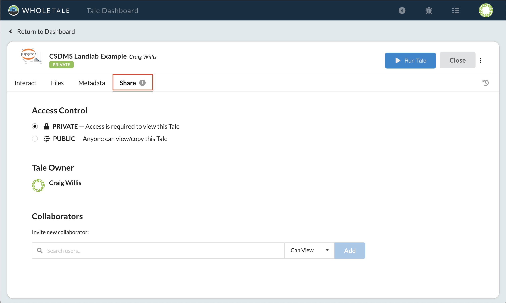
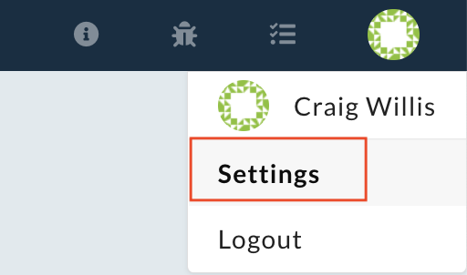
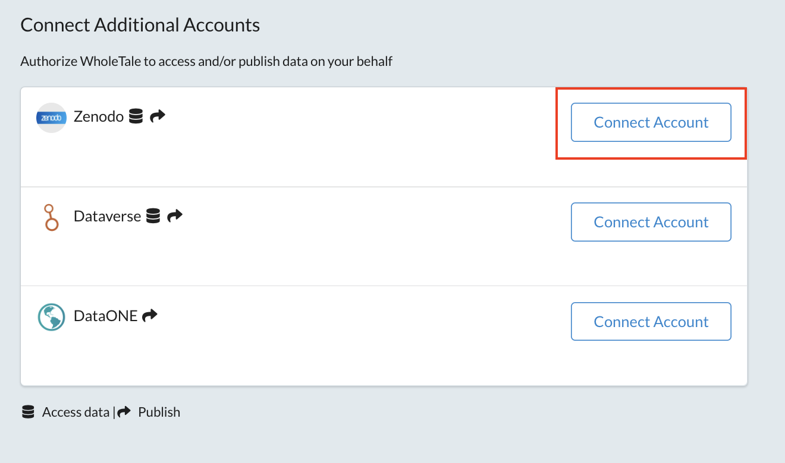
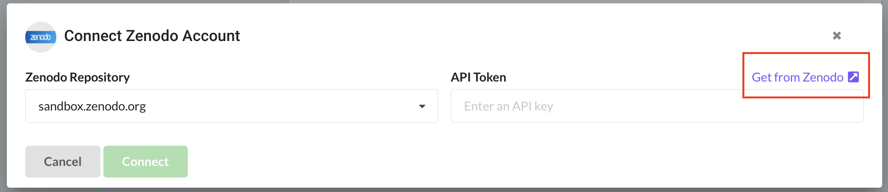
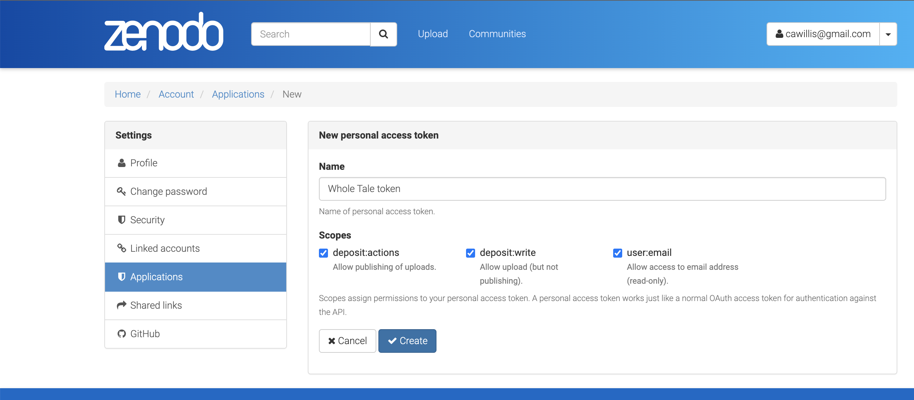
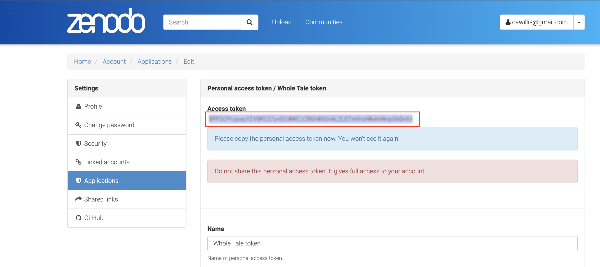
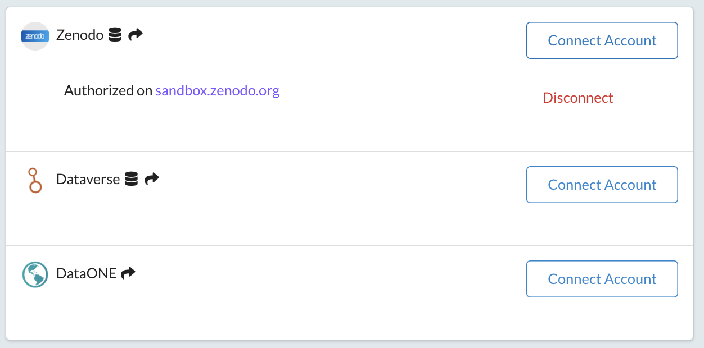
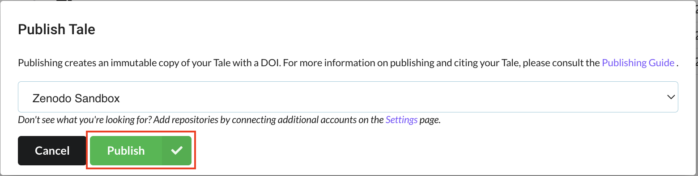
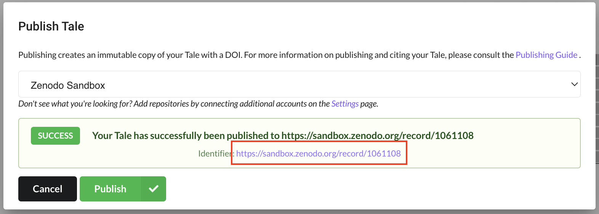

# Sharing, Exporting, and Publishing Tales

Questions:
* How can I share my tale with other users?
* What are the different permissions?
* How can I export my tale?
* How can I publish my tale?

Objectives:
* Learn how sharing works in Whole Tale
* Learn about the different user permissions
* Learn the differences between sharing, exporting, and publishing

## Activity: Sharing a tale

Sharing enables you to allow user users to view, copy, or collaborate on your tale.

From your tale, select the **Share** tab.

Tales have two broad access modes:
* **Private**: The tale is visible only to you or other users you have explicitly shared it with
* **Public**: The tale is accessible (read-only) to all users of the Whole Tale system

You can invite collaborators regardless of this mode. 

To share a tale with another user (Note: currently collaborators must have an existing Whole Tale account):
* Use the **Collaborator search box** to search for their name
* Select the desired permission:
  - **Can view**: Has read-only access to your tale, but can make a copy.
  - **Can edit**: Has edit permission to your tale.
  - **Owns**: Co-owns the tale (i.e., can delete tale versions, recorded runs, or the tale itself; can publish)

Note:
* Users with read-only access to your tale must make a copy to start an interactive environment. 
* Users with edit permissions can modify metadata, files, external data, versions, and runs.
* All users have their own separate container instances. In other words, you share access to the filesystem but never share the same IDE instance.

## Activity: Exporting a tale

At any time you can export your tale as a zip archive:
* Select the tale menu  > **Export**
* A zip archive will be downloaded to your local system.

Note:
* Each exported tale contains a single tale version. You can export additional versions by selecting the  menu from a version via the tale history panel .
* Whole Tale uses an archival export format based on the BagIt and emerging Research Object standards. See this [paper](https://ieeexplore.ieee.org/document/9041738) for more details.

## Activity: Publishing a Tale

Whole Tale allows you to easily publish (or deposit) to Zenodo and a subset of DataONE member repositories. (Of course, you can always export your tale and deposit anywhere you'd like). In this example, we'll demonstrate publishing your example tale to Zenodo's sandbox environment.

This step assumes that you have a valid Github or ORCID login for access to Zenodo.

First, you must connect Whole Tale to Zenodo:
* Select the user menu 
* Select **Settings**

* Next to Zenodo, select **Connect Account**

* In the **Connect Zenodo Account** window, under **Zenodo Repository**, select `sandbox.zenodo.org`
* Select the **Get from Zenodo** link, which will open a new tab or window
* Please confirm that you are accessing `sandbox.zenodo.org`

* At this point you will need to login using your Github, ORCID or Zenodo credentials. If necessary, create a Zenodo account.

* To create a **New personal access token**
  - Enter a name for your access token
  - Check all of the scopes
  - Select **Create**
  - Copy the generated access token someplace safe

* Return to the Whole Tale dashboard and enter the generated token into the **API Token** field
* Select **Connect**
* Confirm that you see the message **Authorized on sandbox.zenodo.org**

Return to your example Tale:
* Select **Tale Dashboard**
* Select **View** on your currently running Tale

Publish your tale to Zenodo:
* Select the tale menu 
* Select **Publish**
* In the **Publish Tale** dialog select "Zenodo Sandbox"

* Select **Publish**
* Note: You must have a valid ORCID URL for each author, otherwise publish will fail with an error
* Open the link to your Zenodo sandbox record

## Key points:

* You can share your tale within the Whole Tale system
* Other users can have view (read-only), edit (write), or ownership (delete) permissions
* If your tale is public in Whole Tale, all system users will have view access
* At any time you can export a version of your tale as a zipfile
* You can publish your tale to supported repositories via Whole Tale 
* You can also publish the exported tale to any repository outside of Whole Tale

