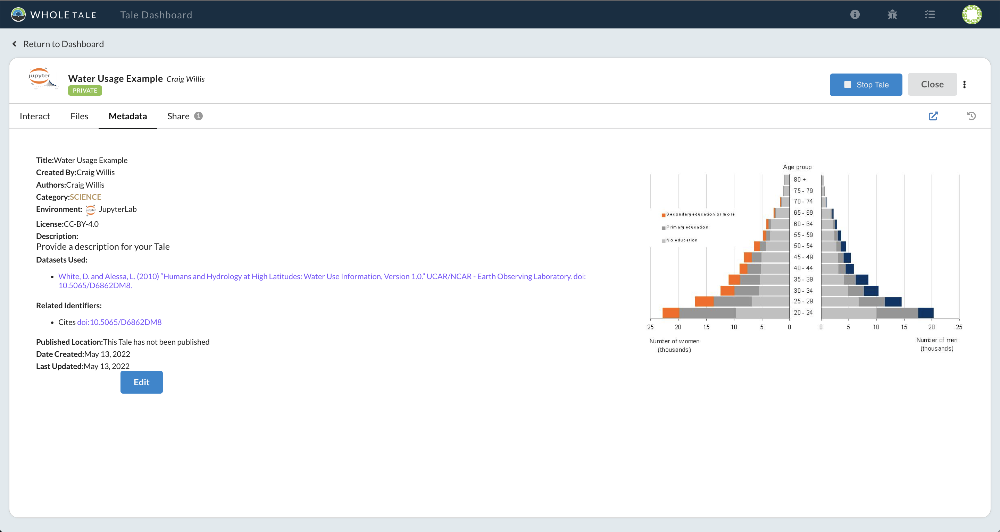

# Working with External Data

Whole Tale allows you to work with and publish references to externally managed data instead of copying the data into your tale.

Questions:
* What is "external data"?
* How do I register and cite external data?

Objectives:
* Learn about automatic data citation in Whole Tale
* Learn which repositories are currently supported

## Use case

A researcher is publishing the results of an analysis that relies on part of a previously published publicly accessible dataset. Instead of publishing a copy of the source data, they want to reference it in their published tale. The original researchers get proper attribution/credit for their published dataset.

## External Data in Whole Tale

Whole Tale allows you to register data from external repositories for use in your tales. This serves two purposes: 1) to create an explicit link (citation) between your tale and data used and 2) to prevent making multiple copies of published research datasets.  Currently, Whole Tale supports Zenodo, [DataONE Network member nodes](https://www.dataone.org/current-member-nodes), [Dataverse Network members](https://services.dataverse.harvard.edu/miniverse/map/), and the Materials Data Facility. 

## Activity: Register an external dataset

* Create a new tale called **Water usage example** using **JupyterLab**
* Select the **Files** tab then **External Data**
* Select the blue **+** button

* Select **Web (DOI or URL)**
* Enter the DOI `10.5065/D6862DM8`
* Select **Search** to find the `Humans and Hydrology...` dataset then **Register**

What's happening?
* Whole Tale registers the dataset if it doesn't already exist and adds it to your list of registered datasets
* This is a "metadata only" operation -- the files (bytes) aren't transferred until they are accessed

## Activity: Add the data to your tale

* Select the **Files** tab then **External Data**
* Select the blue **+** button then then **WT Data Catalog**
* In the catalog window, double-click the "Humans and Hydrology..." dataset
* Single click the `usco2005.xls` file then **Add Selected** then **Save**

* Select the **Metadata** tab
* Note that the dataset is cited as part of the tale metadata. The citation remains during export and publish.

What's happening?
* The selected file is added to your tale's external data folder (`../data`) and cited in tale metadata

## Activity: Using the data

* Download and extract [quickstart.zip](https://wholetale.readthedocs.io/en/stable/_downloads/5ddd9a1a71506d7c7a61aa280117677f/quickstart.zip) example.
* Select **Files** > **Tale Workspace** > **+** > **Upload File** to upload the extracted files to the workspace
* Select **Run Tale** to start the JupyterLab environment
* Open your JupyterLab instance
* Open the **wt_quickstart.ipynb** notebook then **Run** > **Run All Cells** in JupyterLab
* A map of water usage by county in Texas should display

What's happening?
* The notebook reads the file from `../data`

## Key points:
* Whole Tale allows you to register and add external data to your tales to prevent duplication of data and ensure proper attribution.

## Next

[Working with MATLAB](6-matlab.md)

