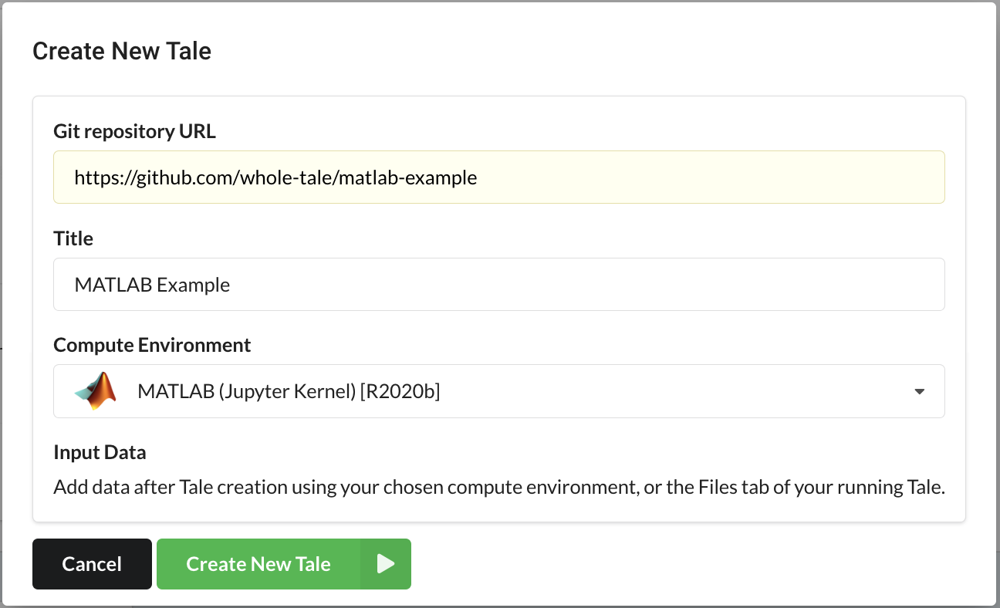
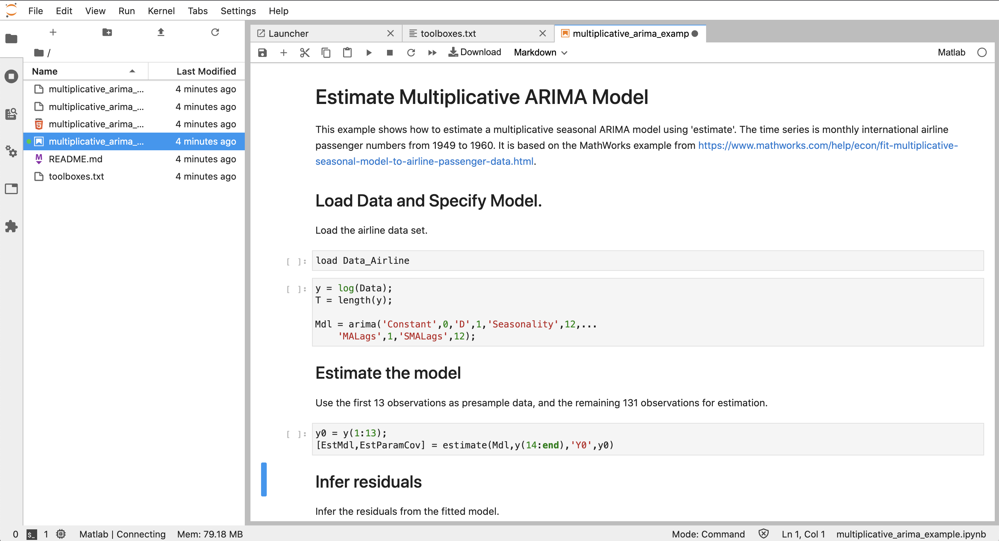

# Working with MATLAB

Whole Tale allows you to create and publish tales based on MATLAB software.

Questions:
* How does Whole Tale support MATLAB?
* Where does the license come from?
* How can I interact with MATLAB?

Objectives:
* Learn about the Whole Tale MATLAB buildpack
* Learn about Jetstream MATLAB licensing
* Learn about the different ways of interacting with MATLAB


## Custom MATLAB buildpack

In Binder's `repo2docker`, "buildpacks" are used to add support for different languages.
Whole Tale adds support for a [MATLAB buildpack](https://wholetale.readthedocs.io/en/stable/users_guide/customizing.html?#matlab).

By creating a `toolboxes.txt` file, you can specify the MATLAB toolboxes required by a tale. For example:
```
product.Financial_Toolbox
product.Statistics_and_Machine_Learning_Toolbox
```

For more information, see the Whole Tale [User's Guide](https://wholetale.readthedocs.io/en/stable/users_guide/environments/matlab.html)

## Jetstream MATLAB License

Since Whole Tale is hosted on the Jetstream Cloud, we leverage MATLAB network licenses provided by Jetstream host institutions (University of Indiana and the Texas Advanced Computing Center).

As noted in our [Terms of Use](https://wholetale.readthedocs.io/en/stable/tos/index.html):

```
MATLAB licensing is on a “right to use” basis and not guaranteed in perpetuity. Absolutely no proprietary, closed, or for-profit use of MATLAB is permitted.
```

## Interacting with MATLAB in Whole Tale

Whole Tale provides three different ways of interacting with MATLAB:
* JupterLab with the Calysto MATLAB kernel
* Full Linux desktop via XPRA (web-based VNC)
* The new MATLAB Web Desktop (Available with MATLAB R2020b)

For more information, see the Whole Tale [User's Guide](https://wholetale.readthedocs.io/en/stable/users_guide/environments/matlab.html)

## Activity:  MATLAB Tale
For this example, we'll demonstrate only the Jupyter kernel.

* Select **Create New Tale** > **Create New Tale from Git Repository**
* Create a new tale with the following settings:
  * **Git repository URL**: https://github.com/whole-tale/matlab-example
  * **Title**: MATLAB Example
  * **Compute Environment**: MATLAB (Jupyter Kernel) [R2020b]
* Select **Create New Tale** button



* Select **Run Tale** to start the JupyterLab environment
* Open the **multiplicative_arima_example.ipynb** notebook
* In JupyertLab, select **Run** > **Run All Cells**




## Key points
* Whole Tale supports commercial software including MATLAB by using custom `repo2docker` buildpacks
* MATLAB network licenses are provided by Jetstream host institutions and subject to terms of use
* This exercise demonstrated the Jupyter Kernel integration, but you can also use the Web Desktop or XPRA (web-based VNC) environments.


## Next

[Review](7-review.md)
